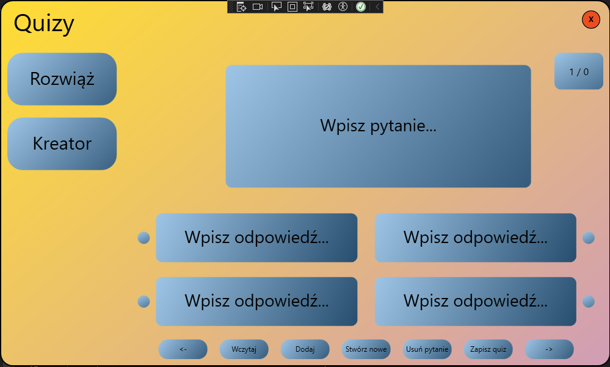
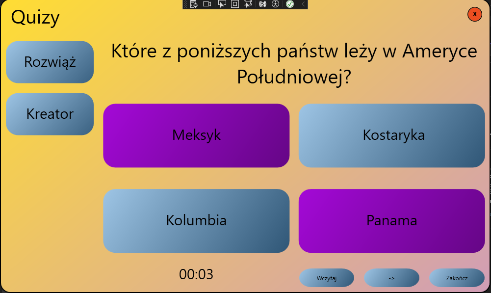

# 🧠 QuizApp - Twórz, Rozwiązuj, Ucz się!

Nowoczesna aplikacja desktopowa służąca do tworzenia i rozwiązywania testów wiedzy. Idealne narzędzie zarówno dla nauczycieli chcących przygotować materiały, jak i studentów pragnących sprawdzić swoją wiedzę.

## 📸 Rzut oka na aplikację

## 🚀 Główne Funkcjonalności

Aplikacja została zaprojektowana z myślą o prostocie i elastyczności:

* **✏️ Kreator Quizów:** Wbudowany edytor pozwalający tworzyć nowe zestawy pytań bez wychodzenia z aplikacji.
* **🎮 Tryb Rozwiązywania:** Interaktywny interfejs dla użytkownika z natychmiastową informacją zwrotną o poprawności odpowiedzi.
* **📂 Import JSON:** Możliwość wczytywania gotowych quizów z plików tekstowych. Dzięki temu łatwo podzielisz się testami ze znajomymi.
* **📊 Podsumowanie:** Po zakończeniu testu otrzymujesz wynik i statystyki.

## 🛠️ Pod maską (Tech Stack)

Projekt realizuje wysokie standardy inżynierii oprogramowania:

* **Język:** C# (.NET)
* **Framework UI:** WPF (Windows Presentation Foundation)
* **Architektura:** **MVVM** (Model-View-ViewModel)
* **Dane:** Serializacja JSON (Newtonsoft.Json).
* **Szyfrowanie:** Pliki JSON są szyfrowane za pomocą AES
